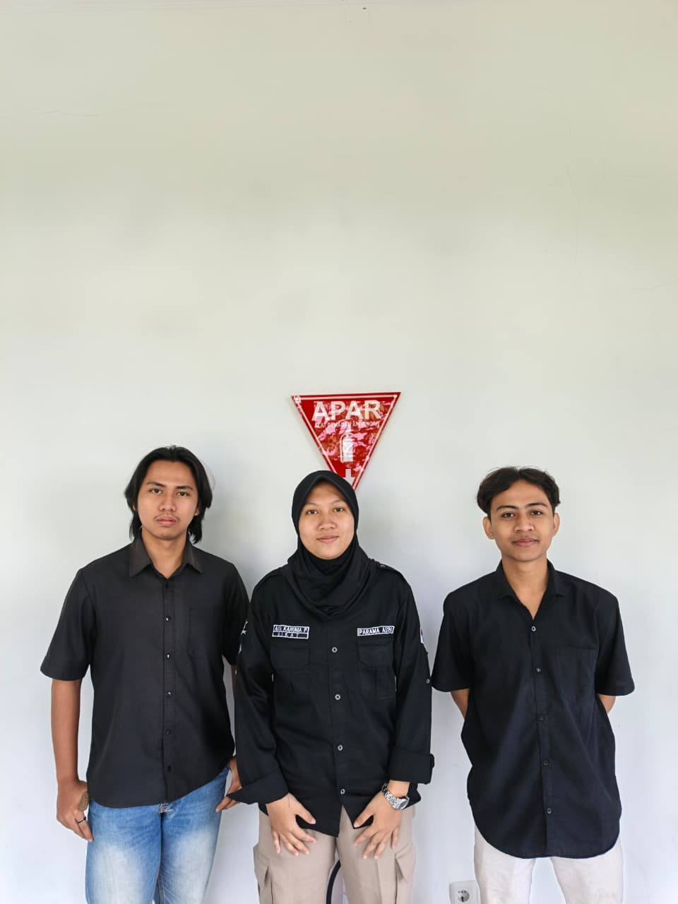

### CAPSTONE DESIGN 2026

### KELOMPOK 3 - KUMITIKA

### Members
1. Gunady Sidik - H1A023004
2. Dika Aditya Saputra - H1A023088
3. Aliya Karunia Putri - H1A023111

### Project Title

Monitoring Parameter dan Daya Listrik berbasis <i>Internet of Things</i>

### Project Description
    Pada Capstone Project ini kami mengangkat topik pemantauan konsumsi energi listrik pada rumah kos yang hanya menggunakan satu kWh meter untuk melayani beberapa kamar sekaligus. Masalah utama muncul pada mitra kami, Kost Pak Maryoto, di mana para penghuni sering mengeluhkan sistem pembayaran tagihan listrik yang dipukul rata. Ketidakadilan ini menjadi sumber konflik karena setiap penghuni memiliki pola penggunaan perangkat elektronik dan beban listrik yang berbeda-beda.
    Sebagai solusi, Kumitika menghadirkan sebuah sistem cerdas yang dirancang untuk memonitor penggunaan energi listrik secara spesifik di setiap kamar. Dengan teknologi ini, sistem mampu mencatat konsumsi energi secara akurat dan memberikan estimasi biaya yang harus dibayarkan oleh masing-masing penghuni berdasarkan penggunaan riil mereka. Inovasi ini tidak hanya mempermudah manajemen keuangan bagi pemilik kos, tetapi juga menciptakan sistem pembagian tagihan yang jauh lebih transparan dan adil bagi seluruh penyewa.

### System Requirements
- Sistem mampu mengukur parameter tegangan, arus, daya, dan energi listrik.
- Sistem mampu mengestimasi biaya yang dikeluarkan dari penggunaan energi listrik.
- Sistem mampu mengirim notifikasi saat terjadi kondisi parameter melebihi nilai _threshold_.
- Sistem mampu menamplikan nilai hasil pengukuran pada _display_ lokal.
- Sistem mampu menamplikan nilai hasil pengukuran pada _dashboard_.

### Contact Us

_Instagram_
[Gunady Sidik](https://www.instagram.com/gdy.sidik/)
[Dika Aditya S](https://www.instagram.com/dikaditya_1/)
[Aliya Karunia P](https://www.instagram.com/_aliyakape/)