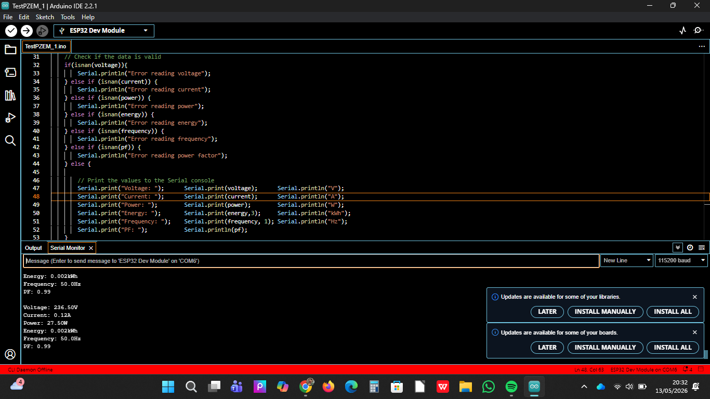

## Logbook Kelompok 3

Mata kuliah: Capstone Design

Semester: Genap 2025/2026

Anggota

1. Mahasiswa: @gdysidik
2. Mahasiswa: @dikaaditya486-cyber
3. Mahasiswa: @aliyakp05

### 30 April 2026

#### Yang sudah dilakukan

- Pembelian sensor pzem004t.
- Pembelian hilink 220 VAC-5 VDC converter.

#### Masalah yang dihadapi

- Belum ada.

#### Yang akan dilakukan

- [x] Melengkapi pembelian barang. PIC: @aliyakp05
- [x] Merancang program pengujian sensor. PIC: @gdysidik

#### Catatan

- Belum ada :drooling_face:

### 04 Mei 2026

#### Yang sudah dilakukan

- Melengkapi pembelian komponen baik online maupun offline.
- Testing kirim data dari ESP32 ke Google Sheets.

#### Masalah yang dihadapi

- Ada beberapa barang yang ingin dicari offline tetapi ternyata tidak tersedia/habis.
- Ada tambahan pembelian barang yaitu panel box.
- Delay cukup besar saat kirim data.

#### Yang akan dilakukan

- [x] Membeli panel box. PIC: @aliyakp05
- [x] Mencari kembali barang yang tidak tersedia ke toko lain. PIC: @dikaaditya486-cyber dan @gdysidik

#### Catatan

- Kirim data ke Google Sheets baik data konstan maupun variabel sudah berhasil tetapi masih ada kendala.

### 6 Mei 2026

#### Yang sudah dilakukan

- Membeli panel box.

### Masalah yang dihadapi

- Ukuran panel box yang sesuai cukup sulit ditemui.

#### Yang akan dilakukan

- [x] Membeli lcd i2c. PIC: @aliyakp05
- [x] Mencari kembali barang yang tidak tersedia ke toko lain. PIC: @dikaaditya486-cyber dan @gdysidik

#### Catatan

- Nothing :grimacing:

### 8 Mei 2026

### Yang sudah dilakukan

- Merencanakan placement.

### Masalah yang dihadapi

- Masih belum menemukan placement yang sesuai dengan ukuran panel box.

#### Yang akan dilakukan

- [x] Menentukan placement yang sesuai dengan ukuran panel box. PIC: @all
- [x] Membeli MCB dan skun. PIC: @dikaaditya486-cyber

#### Catatan

- Nothing :grimacing:

### 9 Mei 2026

#### Yang sudah dilakukan

- Membeli MCB 4 A.
- Membuat PCB daya dan PCB kontrol.
- Tes koneksi tiap jalur pada PCB dengan menggunakan multimeter.

#### Masalah yang dihadapi

- PCB daya dan kontrol terlalu besar sehingga memakan ruang di dalam panel box.

#### Yang akan dilakukan

- [x] Menyesuaikan ukuran PCB daya dengan memotong bagian sisa semaksimal mungkin. PIC: @gdysidik
- [x] _Wiring_ komponen untuk pengujian. PIC: @all

#### Catatan

- PCB kontrol juga sisa banyak, tapi _space_-nya bisa digunakan untuk tempat _current transformer_.

### 11 Mei 2026

#### Yang sudah dilakukan

- Membuat dashboard monitoring 

#### Masalah yang dihadapi

- Masih belom mengetahui batas limit database

#### Yang akan dilakukan

- [ ] Menyempurnakan dashboard agar sesuai dengan dashboard monitoring. PIC: @dikaaditya486-cyber
- [ ] Pengujian dashboard. PIC : @all

#### Catatan

- Nothing :grimacing:

### 12 Mei 2026

#### Yang sudah dilakukan

- _Wiring_ komponen untuk pengujian sensor.

#### Masalah yang dihadapi

- Konektor AC gosong :sweat_smile: :upside_down_face:.
- Sensor tidak menerima command dari ESP32 ketika menggunakan input daya terpisah/beda sumber.

#### Yang akan dilakukan

- [x] Pengujian Sensor PZEM. PIC : @all
- [x] Mengatur ulang rangkaian daya ESP32 dan komunikasi sensor lewat satu jalur (laptop) agar serial monitor terpantau.
- [x] _Wiring_ bagian beban agar sensor bisa melakukan metering.

#### Catatan

- Selalu pastikan mengecek dulu biar semua aman :ghost:.

### 13 Mei 2026

#### Yang sudah dilakukan

- _Wiring_ bagian beban.
- Mengatur ulang rangkaian daya ESP32 dan komunikasi sensor lewat satu jalur (laptop) agar serial monitor terpantau.
- Menguji sensor PZEM-004T.

#### Masalah yang dihadapi

- Kabel bagian beban sedikit kurang terancang dengan baik sehingga _current transformer_ sulit terinstal.

#### Yang akan dilakukan

- [x] Rekonstruksi _wiring_ bagian beban.
- [x] Mulai _wiring_ komponen yang disesuaikan dengan panel box.

#### Catatan

- Pengujian sensor berhasil dengan hasil sebagai berikut:

|               BEBAN              | TEGANGAN TERUKUR (V) | ARUS TERUKUR (A) | DAYA TERUKUR (W) |
|:---------------------------------|---------------------:|-----------------:|-----------------:|
| Charger 10 Wdc                   | 236.6                | 0.04             | 4.8              |
| Charger 10 Wdc + Charger 45 Wdc  | 235.3                | 0.34             | 45.6             |
| Solder                           | 236.5                | 0.13             | 31.1             |

Lampiran output pengujian:

### 15 Mei 2026

#### Yang sudah dilakukan

- Membuat bot testing di telegram untuk terima notifikasi.
- Coba koneksi esp32 dengan bot telegram yang telah dibuat.

#### Masalah yang dihadapi

- Nothing :pray:

#### Yang akan dilakukan

- [x] Membuat bot telegram yang akan digunakan pada sistem.
- [x] Merancang kerangka program seluruh sistem.

### Catatan 

- Testing awal berhasil, bot telegram dapat memunculkan pesan sesuai program di Arduino IDE

### 21 Mei 2026

#### Yang sudah dilakukan

- Rekonstruksi _wiring_ bagian beban.
- _wiring_ komponen yang disesuaikan dengan panel box.
- Membuat bot telegram yang akan digunakan pada sistem.
- Merancang kerangka program seluruh sistem.

#### Masalah yang dihadapi

- Nothing :pray:

#### Yang akan dilakukan

- [x] Mencoba mengirim data notifikasi dari esp32 ke bot telegram dan sebaliknya.
- [x] Mencoba LCD I2C sebagai display lokal.
- [x] Melakukan perombakan panel box sehingga penggunaannya sesuai dengan kebutuhan sistem.

### Catatan 

- Nothing :smiley:

### 26 Mei 2026

#### Yang sudah dilakukan

- Inspeksi _wiring_ sistem untuk menjaga keamanan komponen dan pengguna.
- Melakukan _unit testing_ pada sensor sesuai ID-REQ.001 (baca data tegangan, arus, daya, energi). Implementasinya adalah dengan menghubungkan dua bagian utama sensor, yakni bagian _metering_ dan bagian komunikasi data. Terdapat 2 bagian _metering_ pada sensor yakni menghubungkan fasa dan netral secara paralel ke bagian _metering_ tegangan sensor, serta menghubungkan CT pada bagian _metering_ arus sensor. Jalur fasa yang menuju beban kemudian dilewatkan ke dalam celah yang terdapat pada CT sehingga arus dapat terbaca. Sementara pada bagian komunikasi data, pin RX sensor dihubungkan ke pin TX2 ESP32 dan pin TX sensor dihubungkan dengan pin RX2 ESP32, serta dua pin daya +5 Vdc dan GND.
- Melakukan _system testing_ sesuai ID-REQ.002 (estimasi biaya berdasarkan penggunaan energi). Implementasinya adalah dengan mengambil data energi (kWh) dari sensor, kemudian mengalikannya dengan data harga per kWh yang diketahui, dalam hal ini yang digunakan adalah harga _dummy_ per kWh sebesar Rp1000.
- Melakukan _system testing_ sesuai ID-REQ.003 (kirim notifikasi ke Telegram saat melebihi nilai _threshold_). Implementasinya adalah dengan menentukan nilai _default_ ambang batas daya dan harga, dalam hal ini digunakan nilai _default_ batas daya 800 W dan batas harga Rp50000. Saat pengujian, nilai batas daya dan harga diset lebih rendah agar notifikasi lebih mudah di-_trigger_. Data yang dikirim ke Telegram menggunakan bantuan pustaka UniversalTelegramBot, ArduinoJson, dan WiFiClientSecure.
- Melakukan _system testing_ sesuai ID-REQ.004 (menampilkan data pada LCD 16x2 I2C). Implementasinya adalah dengan menghubungkan dua jalur komunikasi I2C yakni SDA LCD ke SDA ESP32 (D21) dan SCL LCD ke SCL ESP32 (D22), serta dua pin daya +5 Vdc dan GND. Data sensor yang terbaca kemudian dikirim ke LCD dengan bantuan pustaka LiquidCrystal_I2C.

#### Masalah yang dihadapi

- Sempat terdapat bug saat pengujian komunikasi ke Telegram di mana pesan hasil _request_ muncul secara terus-menerus.
- Sempat gagal saat implementasi ID-REQ.004 karena LCD digunakan pada _header_ lain (konfig_network.h) dalam program sebelum diinisialisasi.

#### Yang akan dilakukan

- [ ] Membuat dan menguji _dashboard_ sesuai dengan ID-REQ.005.
- [ ] Membuat dan menguji _data logging_ sesuai dengan ID-REQ.006.
- [ ] Kalibrasi/penyesuaian pengolahan data sensor supaya lebih akurat.

#### Catatan

- Implementasi ID-REQ.001 terbaca dengan cukup baik. Pembacaan tegangan di alat ukur sebesar 220 V, sedangkan sensor membaca 222 V. Pembacaan arus di alat ukur sebesar 0.086 A, sedangkan sensor membaca 0.094 A.
- Data notifikasi di telegram sesuai dengan pembacaan yang ditampilkan pada LCD.
- Menambahkan _command_ untuk mengubah _threshold_ daya dan harga, mengubah harga per kWh, dan reset total energi (kWh). 

<!-- ### 02 Des 2025

#### Yang sudah dilakukan

#### Masalah yang dihadapi

#### Yang akan dilakukan

#### Catatan

### 09 Des 2025

#### Yang sudah dilakukan

#### Masalah yang dihadapi

#### Yang akan dilakukan

#### Catatan -->